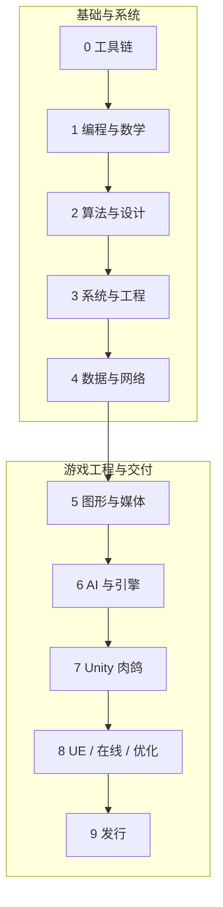

# 课程总览

从阶段 0 开始按顺序推进；也可以按当前项目问题跳转，但应先检查课程首页中的前置。状态只表示公开内容是否已经生成，不代表任何学习者的进度。

## 阶段 0 · 工具链

-   :material-book-open-page-variant-outline: **[工具链与 Git](courses/toolchain-and-git/README.md)**

    D2 P0 准备中

    把环境、版本控制、构建、调试和自动检查变成可靠的日常工作流。

    <strong>出口：</strong>交付一个能从全新环境复现构建、测试和发布的最小游戏工程。

## 阶段 1 · 编程与数学

-   :material-book-open-page-variant-outline: **[C 程序设计](courses/c-programming/README.md)**

    D3 P0 准备中

    从内存、指针、数据布局和生命周期理解游戏底层，而不是只会写语法。

    <strong>出口：</strong>实现并验证一个内存边界清晰、可调试的小型运行时组件库。

-   :material-book-open-page-variant-outline: **[离散数学](courses/discrete-mathematics/README.md)**

    D3 P1 准备中

    用逻辑、集合、关系、图和状态机精确表达房间、规则与组合系统。

    <strong>出口：</strong>建立可验证的房间图、状态机或道具规则模型。

-   :material-book-open-page-variant-outline: **[游戏线性代数](courses/linear-algebra-for-games/README.md)**

    D3 P1/P2 准备中

    掌握向量、矩阵、坐标系、旋转与投影在移动、相机和渲染中的机制。

    <strong>出口：</strong>独立推导并实现一组可视化的 2D/3D 变换实验。

-   :material-book-open-page-variant-outline: **[微积分与概率](courses/calculus-and-probability/README.md)**

    D2 P1/P3 准备中

    连接运动、插值、数值变化与可控随机，避免只会套公式。

    <strong>出口：</strong>构建可复现的运动与掉落模拟，并用数据验证分布和误差。

## 阶段 2 · 算法与程序设计

-   :material-book-open-page-variant-outline: **[数据结构](courses/data-structures/README.md)**

    D3 P0/P1 准备中

    理解容器、队列、哈希、树、图、对象池的成本与运行时边界。

    <strong>出口：</strong>为房间、实体、事件或资源选择并实现合适的数据结构。

-   :material-book-open-page-variant-outline: **[算法分析](courses/advanced-data-structures-algorithms/README.md)**

    D3 P1 准备中

    用复杂度、空间索引、图算法和调度方法解决规模化游戏问题。

    <strong>出口：</strong>实现可基准测试的寻路、查询或调度模块，并解释取舍。

-   :material-book-open-page-variant-outline: **[游戏 OOP](courses/object-oriented-programming/README.md)**

    D3 P0/P2 准备中

    用组合、接口、生命周期和所有权构建可维护的 C++/C# 玩法模块。

    <strong>出口：</strong>完成一个可扩展且可测试的战斗或道具领域模型。

## 阶段 3 · 系统与工程

-   :material-book-open-page-variant-outline: **[组成与体系结构](courses/computer-organization/README.md)**

    D2 P0/P2 准备中

    把指令、缓存、数据布局、SIMD 和 CPU/GPU 协作映射到帧预算。

    <strong>出口：</strong>用基准与性能数据解释一次真实的数据布局或缓存优化。

-   :material-book-open-page-variant-outline: **[操作系统](courses/operating-systems/README.md)**

    D3 P0/P2 准备中

    理解进程、线程、同步、文件、虚拟内存和任务系统如何支撑游戏运行时。

    <strong>出口：</strong>实现并诊断一个有明确所有权、同步和失败路径的并发任务实验。

-   :material-book-open-page-variant-outline: **[游戏软件工程](courses/software-engineering/README.md)**

    D3 P3/P5 准备中

    围绕需求、边界、测试、CI、协作和演进控制项目复杂度。

    <strong>出口：</strong>把一个玩法模块交付成可维护、可回归、可持续迭代的工程切片。

## 阶段 4 · 数据与网络

-   :material-book-open-page-variant-outline: **[游戏数据库](courses/database-systems/README.md)**

    D2 P3/P5 准备中

    从建模、约束、索引和事务设计存档、配置、账号与内容数据。

    <strong>出口：</strong>实现可迁移、可校验、可恢复的存档或内容数据方案。

-   :material-book-open-page-variant-outline: **[多人游戏网络](courses/computer-networks/README.md)**

    D3 network-lab/P5 准备中

    从协议、拥塞、延迟和丢包理解多人同步的物理限制。

    <strong>出口：</strong>做出可观测的客户端/服务器实验并解释预测、插值与权威性。

## 阶段 5 · 图形与媒体

-   :material-book-open-page-variant-outline: **[计算机图形学](courses/computer-graphics/README.md)**

    D3 P2/P3 准备中

    从变换、光栅化、着色与可见性理解画面如何生成以及为何变慢。

    <strong>出口：</strong>实现一条最小渲染实验并能用帧数据定位视觉或性能问题。

-   :material-book-open-page-variant-outline: **[多媒体与资源管线](courses/multimedia-and-asset-pipeline/README.md)**

    D2 P3/P5 准备中

    理解纹理、动画、音频、压缩、导入和异步加载的生产成本。

    <strong>出口：</strong>建立可重复导入、校验、打包和加载的最小资源管线。

## 阶段 6 · 语言、AI 与引擎

-   :material-book-open-page-variant-outline: **[编译原理与 DSL](courses/compiler-principles-and-dsl/README.md)**

    D2 dsl-lab/P3 准备中

    用词法、语法、AST、解释与诊断构建可控的游戏配置语言。

    <strong>出口：</strong>实现一个带错误定位和测试的迷你配置 DSL。

-   :material-book-open-page-variant-outline: **[编程语言与脚本](courses/programming-language-principles/README.md)**

    D2 dsl-lab/P3 准备中

    比较类型、闭包、泛型、内存管理和并发模型，理解脚本边界。

    <strong>出口：</strong>为玩法脚本选择合适的执行与绑定方案，并说明安全和性能边界。

-   :material-book-open-page-variant-outline: **[游戏 AI](courses/game-ai/README.md)**

    D2 P1/P3 准备中

    把状态机、行为树、寻路、效用和程序化生成变成可调试的决策系统。

    <strong>出口：</strong>实现一个能解释决策、复现行为并接受设计调参的敌人 AI。

-   :material-book-open-page-variant-outline: **[游戏引擎架构](courses/game-engine-architecture/README.md)**

    D3 P2/P4 准备中

    贯通帧循环、场景、实体组件、资源、序列化、反射与工具层。

    <strong>出口：</strong>构建一个小型运行时切片，并明确各系统的状态和生命周期。

## 阶段 7 · Unity 肉鸽

-   :material-book-open-page-variant-outline: **[Unity 肉鸽生产](courses/unity-roguelite-production/README.md)**

    D3 P3 准备中

    把战斗、房间、道具、随机、存档、反馈和工具整合为可玩的纵切片。

    <strong>出口：</strong>完成可重复游玩 10–15 分钟、可测试和可打包的 2D 肉鸽核心循环。

## 阶段 8 · UE、在线与优化

-   :material-book-open-page-variant-outline: **[UE 玩法编程](courses/unreal-gameplay-programming/README.md)**

    D2→D3 P4 准备中

    把已有原理迁移到 UE C++、蓝图、Gameplay 框架与数据驱动工作流。

    <strong>出口：</strong>在 UE 中重建一个边界清晰、可调试的玩法系统。

-   :material-book-open-page-variant-outline: **[在线服务](courses/game-networking-and-services/README.md)**

    D2→D3 network-lab/P5 准备中

    把权威服务器、复制、匹配、账号、遥测和运营接口连成可信系统。

    <strong>出口：</strong>交付一个考虑信任边界、故障恢复与可观测性的在线功能原型。

-   :material-book-open-page-variant-outline: **[优化、调试与工具](courses/optimization-debugging-and-tools/README.md)**

    D3 P3/P5 准备中

    建立测量优先的 CPU/GPU/内存诊断方法，并把重复劳动产品化为工具。

    <strong>出口：</strong>用证据修复一个性能或稳定性问题，并留下可复用的诊断工具。

## 阶段 9 · 发行

-   :material-book-open-page-variant-outline: **[发行与毕业项目](courses/shipping-and-capstone/README.md)**

    D3 P5 准备中

    完成范围控制、测试、构建、平台适配、商店材料和上线后的版本闭环。

    <strong>出口：</strong>发布一个可下载、可复现构建并有完整验收证据的小型肉鸽游戏。

