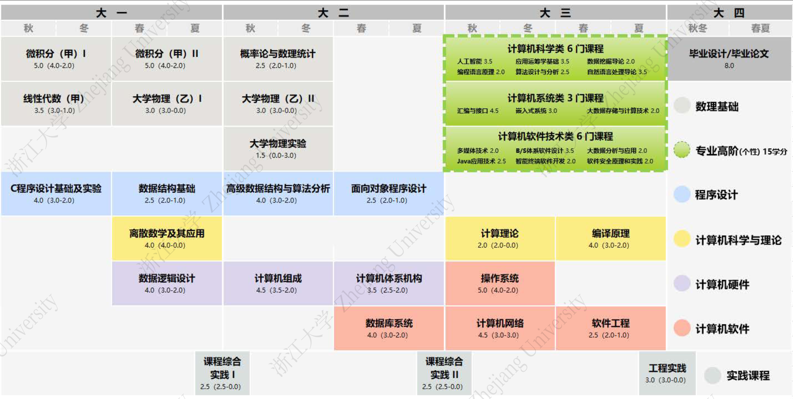

# 游戏开发究极知识包

> **当前版本的目的：先把学习和知识生成的生产线搭好。**

这不是按教程链接堆出的收藏夹，而是一个把计算机科学基础、游戏工程、Unity/Unreal Engine、肉鸽系统和发行实践连成闭环的公开知识库。

## 从哪里开始

1. 阅读[学习路线总览](roadmap.md)，理解阶段、深度和出口能力；
2. 查看[培养方案映射](roadmap/curriculum-mapping.md)，知道哪些课为何要学；
3. 阅读[实践体系](roadmap/practice-system.md)，先建立少量可持续项目；
4. 后续每次只按[课程索引](roadmap/course-index.md)生成下一门课程；
5. 课程生成必须遵守[标准中心](standards/README.md)。

## 目标作品

主线作品是一个范围受控的 2D 肉鸽动作游戏纵切片，灵感可以来自公开市场上的同类作品，但不复制其素材或私有实现。它必须具备：

- 可复现的随机种子；
- 房间/关卡推进；
- 可组合的道具与效果；
- 战斗、敌人、奖励、存档和基础反馈；
- 调试、测试、性能检查、打包和发行说明。

3A、MOBA、FPS 的内容会作为架构对照和选修分支出现，而不是让主项目无限膨胀。

## 培养方案参考图

