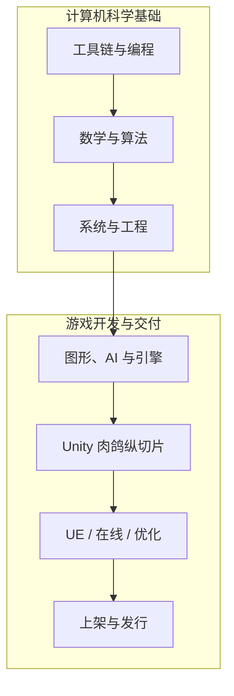

# 游戏开发究极知识包

**以游戏开发为主线，系统学习真正用得上的计算机科学。**

目标不是收藏教程，而是逐步做出一个可测试、可打包、可发行的 2D 肉鸽动作游戏，并把能力迁移到 Unity、Unreal Engine、在线服务与大型项目工程。

[进入课程总览 :material-arrow-right:](course-index.md){ .md-button .md-button--primary }
[查看完整路线](roadmap.md){ .md-button }

## 你会沿着什么路线学习

-   :material-school-outline:{ .lg .middle } **课程优先**

    ---

    左侧导航首先展示课程与阶段；生成规范和维护资料统一放在最后。

    [浏览全部课程](course-index.md)

-   :material-gamepad-variant-outline:{ .lg .middle } **少而精的实践**

    ---

    每门课最多一个主实践和两个微实验，实践数量是上限，不是必须凑满的配额。

    [查看实践主线](roadmap/practice-system.md)

-   :material-lightbulb-on-outline:{ .lg .middle } **先思考，再展开解析**

    ---

    题目、最小提示、完整解析和实践参考路线公开提供，默认折叠，按需查看。

    [了解学习方法](learning-workflow.md)

-   :material-bookmark-check-outline:{ .lg .middle } **自动续学**

    ---

    浏览器自动保存课程页面与阅读位置；不要求打卡、填写进度表或上传个人记录。

    [自动续学说明](automatic-progress.md)

## 最终作品

主线项目是一个范围受控的“小以撒”式 2D 肉鸽动作游戏纵切片，重点验证：

- 可复现的随机种子与房间推进；
- 可组合、可冲突处理、可存档的道具与效果系统；
- 战斗、敌人、奖励、反馈与调试工具；
- 测试、性能检查、构建、商店材料和发行流程。

《以撒的结合》类游戏用于拆解组合系统和内容规模；肉鸽 ACT、MOBA、FPS 与 3A 项目用于解释不同规模下的架构、网络和生产取舍，不复制商业项目素材或私有实现。
