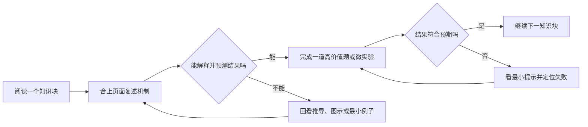

# 如何学习、做题与实践

## 最短路径

一次只处理一个可验证知识块，不需要抄完整笔记、打卡或维护学习档案。

## 阅读

1. 先看课程首页：知道这门课解决什么问题、需要哪些前置、最终要交付什么；
2. 浏览课程地图：只建立章节关系，不急着记细节；
3. 正文遇到新术语时先理解定义和边界，再看代码或引擎 API；
4. 每学完一个核心概念，离开原文，用自己的话回答“机制、边界、游戏映射、验证方式”。

!!! tip "判断自己是否真的懂了"
    如果只能复述结论，却不能预测一个反例、解释一次失败或设计验证方法，就还没有形成可迁移理解。

## 做题

题目默认采用：

1. **心答或纸答**：先形成自己的结论；
2. **最小提示**：卡住时只展开提示；
3. **完整解析**：核对机制、边界与验证证据；
4. **重新解释**：合上解析后再说一遍，避免“看懂了”的错觉。

答案页面会提供“展开提示”和“全部收起”按钮。除非问题反复出现，否则不要求建立错题本。

## 实践

实践数量是上限，不是配额：一门课可以只有一个高价值实验，也可以是一个主实践加一两个微实验。

- **无引擎实验**：算法、内存、并发、网络、数据库和编译原理优先使用最小命令行程序、测试或可视化模拟器；
- **Unity 主线**：快速验证 2D 战斗、房间、道具、内容工具和完整纵切片；
- **UE 迁移**：在已有原理基础上重建一个系统，用于理解大型工程分层、C++/蓝图边界和网络框架；
- **个人代码**：可以放在任意位置；若放入本仓库，按需使用被 Git 忽略的 `.practice/<course-slug>/`。

每次实践只保留三类验收证据：**能运行、能解释、能复现失败与修复**。不强制写实验报告。

## 每次学习多长

建议按 45–90 分钟组织一次闭环：

- 25–45 分钟理解一个问题；
- 10–25 分钟做题或最小实验；
- 5 分钟脱离材料复述结论和边界。

时间不足时优先完成“理解 + 一个验证”，不要为了完成目录快速扫过多个章节。
