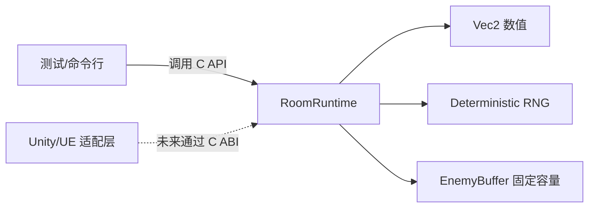

# 17. 综合：从规则、内存到一个小型运行时组件库

前 16 章的产物现在要组合起来。目标不是做一个“迷你游戏引擎”，而是交付一个职责窄、状态所有者明确、可在没有 Unity/UE 的环境中验证的 C 组件：固定容量地保存敌人波次，使用显式 seed 生成可复现的方向/伤害，并返回错误码而不是静默失败。

## 组件边界



领域层拥有 `RoomRuntime` 的规则状态；调用者拥有句柄生命周期；日志、渲染、输入、场景对象不进入核心库。每个公开函数写明初始化、成功、失败和销毁条件。

## 参考实现的阅读任务

进入 `code/runtime-kit/`：

```bash
make clean test
make asan
```

阅读顺序是 `include/rg_runtime.h` → `rg_runtime.c` → `test_runtime.c`。先找到：

1. `RG_RUNTIME_MAX_ENEMIES` 如何成为容量上限；
2. `RgRuntime` 的 `enemy_count` 如何保持不超过容量；
3. seed 从哪里进入 RNG，为什么 `run_id` 不参与规则；
4. `rg_runtime_spawn_wave` 失败时是否留下半更新；
5. `rg_runtime_destroy` 为什么不需要释放单个敌人。

## 失败路径的设计

当波次请求超过容量时，函数返回 `RG_ERR_CAPACITY`，状态保持不变；当输入 seed 无效时，返回 `RG_ERR_INVALID_ARGUMENT`；当测试想要重现结果时，重新初始化同一 seed。把失败码写进文档和测试，不依赖调用者“记得看日志”。

## 游戏映射

这个组件可以驱动一个 Unity 2D 原型的数值层：C# 适配器读取生成的敌人快照，自己负责 Prefab、动画和碰撞；也可以作为 UE C++ 模块中的纯数据算法库。C 组件不应反向持有 `GameObject` 或 `UObject`，否则导出边界会被引擎生命周期绑死。

## 验证出口

完成本章后，必须能在干净目录运行：

```bash
make test
make asan
```

并解释测试覆盖的正常、边界、失败、确定性和销毁路径。下一章把这个组件接到稳定的 C ABI 和 Unity/UE 薄适配器，明确哪些东西可以跨边界，哪些不应跨边界。
