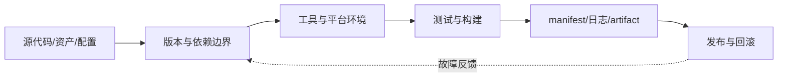

# 工具链与 Git · 课程地图

## 课程不是命令清单，而是一条交付链

本课程的中心问题是：

> **另一台干净机器拿到一个确定提交后，能否知道需要哪些工具、运行哪些命令、生成什么产物、测试是否通过，以及失败时如何定位？**

工具链（toolchain）是把源代码、资产、编译器/编辑器、脚本、测试、打包器和发布系统串起来的可执行路径；可复现工程（reproducible engineering）要求这条路径的输入、版本、配置、输出和证据都能被重建与比较。

## 前置诊断

在没有打开 IDE 的情况下，回答三个问题：

1. 一个小游戏从修改源码到可交付构建，至少有哪些输入和输出节点？
2. Unity 的 `Library/`、UE 的 `DerivedDataCache/` 为什么通常不应作为工程真相？
3. 如果只有 seed=7 的第 3 个房间坏了，什么信息能让别人复现，而不是只让别人“再试一次”？

如果不能区分“源文件”和“可再生目录”，先读第 1、2 章并完成主实践 Checkpoint A。

## 章节依赖与学习动作

| 页面 | 主教学动作 | 不变原则 | 连接实践 |
|---|---|---|---|
| 01 | 分类、画边界、追踪一次构建 | 删除缓存后仍能重建 | 检查 `dist/` 和源输入 |
| 02 | 比较环境、依赖和隐藏输入 | 未记录的读取就是隐藏依赖 | 两次冷构建 |
| 03 | 读提交图、制造冲突、选择回退 | 共享历史优先可审查地新增修复 | Git 分支与 revert |
| 04 | 对照 Unity/UE 项目结构 | 引用、二进制、缓存必须有明确策略 | 资产边界表 |
| 05 | 写构建入口和 manifest | 测试先于昂贵打包，输出必须有身份 | Checkpoint B |
| 06 | 最小复现、日志、bisect | 失败必须可判定、可比较 | Checkpoint C |
| 07 | 分层 CI、artifact、回滚 | 缓存不是产物，绿色不是发布 | 发布清单 |

## 证据标准

每章结束时不要求写长笔记，只需留下三种证据中的一种：

- **能解释**：合上页面说清机制和一个失败边界；
- **能运行**：执行命令、测试或构建并看到预期输出；
- **能迁移**：说明这条原则如何影响 Unity、UE 或肉鸽主项目的一项决策。

## 主实践为什么不用引擎

工具链课程先用标准库 Python 建立最小可复现路径，避免把许可证、编辑器版本、平台 SDK、导入缓存和图形设备混入第一层诊断。完成基础闭环后，再把同一不变量迁移到 Unity/UE：

- Unity：`.meta`、文本序列化、Editor batch 构建、Package/Editor 版本；
- UE：`.uproject`、`Config/`、插件、Automation、BuildGraph/命令行、派生目录；
- 专业团队：二进制资产锁定、LFS/Perforce、构建 farm、符号和 artifact 保留。

这不是说引擎项目简单，而是先隔离变量，再增加工程复杂度。
