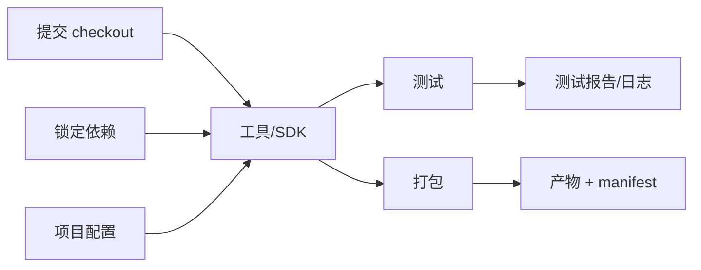

# 1. 从源到产物：工具链边界

## 问题：为什么“我电脑能跑”不是工程描述？

一个游戏工作区通常同时包含六类东西：

| 类别 | 例子 | 默认处理 | 失败时问什么 |
|---|---|---|---|
| 源（source） | C#/C++/Python、场景、材质、配置 | 必须可审查地版本控制 | 这是人写的还是可生成的？ |
| 元数据（metadata） | Unity `.meta`、UE 项目/插件配置、资产 GUID | 和它所标识的源一起提交 | 引用靠什么稳定？ |
| 工具（tool） | 编译器、Unity Editor、Unreal、SDK、打包器 | 锁版本、记录平台与安装方式 | 谁执行、用哪个版本？ |
| 缓存（cache） | Unity `Library/`、UE `DerivedDataCache/`、编译缓存 | 可丢弃、不可作为真相 | 删除后能否重建？ |
| 产物（artifact） | 可执行文件、包、符号、测试报告 | 构建后保存并带清单 | 如何下载、验证、回滚？ |
| 证据（evidence） | 日志、manifest、测试结果、崩溃转储 | 与构建或提交关联 | 失败能否重现与定位？ |

**边界**：产物可以被发布，但不一定应该提交到源仓库；缓存可以加速，但不能成为构建的隐形输入。把缓存提交进 Git 会让仓库变大、合并冲突增加，并掩盖“干净环境其实不能构建”的问题。

## 数据流与不变量



一个可审查的构建至少能回答：

1. 代码和资产来自哪个提交？
2. 工具和 SDK 是什么版本？
3. 依赖从哪里来、如何校验？
4. 目标平台和配置是什么？
5. 使用了哪些环境变量、时间或随机输入？
6. 产物和日志保存在哪里，如何判断它们属于同一次构建？

## Unity 与 Unreal 的同一原则

### Unity

Unity 项目通常需要提交 `Assets/`、`Packages/`、`ProjectSettings/` 以及资产对应的 `.meta`；`Library/`、`Temp/`、`Obj/`、构建输出等是可再生目录。文本序列化和可见元数据有助于审查和合并，但不是“所有场景冲突都能自动解决”。命令行 batch/headless 构建适合 CI，前提是编辑器版本、目标平台模块、许可证和构建脚本已明确。

### Unreal Engine

UE 项目应把 `.uproject`、源码、`Config/`、内容资产和插件配置视为项目输入；`Binaries/`、`Intermediate/`、`Saved/`、`DerivedDataCache/` 等通常属于可再生目录。UE 的源代码控制集成、命令行参数和 Automation System 让团队可以把编辑器操作变成可审查命令，但具体构建工具链会随 Launcher/源码安装、平台 SDK 和 UE 版本变化。

### 专业团队的额外边界

二进制资产不能仅靠“大家小心一点”解决：Git LFS 适合把大文件内容放到独立存储；Perforce 等集中式方案常见于需要锁定/签出和大量二进制协作的团队。选择不是品牌比较，而是回答容量、锁定、离线、审查、恢复和权限问题。

## 验证：删掉缓存再构建

对任一项目做一次“冷启动”演练：

```bash
rm -rf build dist .cache
# 只保留版本控制中的源、配置和锁定依赖
python3 -m unittest discover -s tests -v
python3 src/build.py --output dist --seed 42
cat dist/build-manifest.json
```

如果删缓存后命令无法运行，记录缺少的输入：可能是未提交脚本、未安装 SDK、隐含的全局工具、网络依赖或错误的相对路径。修复优先级是**声明输入**，而不是把整个用户目录打包上传。

!!! tip "验证结论"
    可复现工程的第一步不是选择某个 CI 平台，而是让构建边界在本地可解释、可清理、可重跑。
