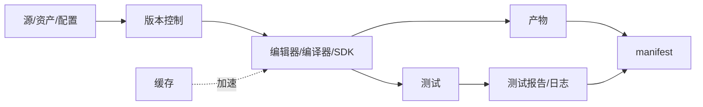

# 1. 源到产物：先画清工程边界

## 先看一个失败场景

开发者把 `Library/`、`Build/` 和 IDE 的本地配置一起提交，项目在他的电脑上“秒开”。另一台机器 clone 后却出现：资产引用丢失、旧构建文件混入新包、构建脚本找不到 SDK。问题不是 Git 不可靠，而是团队没有区分不同状态的所有权。

## 六类输入输出

| 类别 | 含义 | 游戏项目例子 | 验证问题 |
|---|---|---|---|
| 源 source | 人维护、需要审查的输入 | C#/C++、脚本、场景、材质、配置 | 从提交能否读出变化？ |
| 元数据 metadata | 让引用和工具理解源的附加信息 | Unity `.meta`、插件清单、资产 GUID | 删除后引用是否改变？ |
| 工具 tool | 执行转换/编译/打包的程序 | Python、编译器、Unity Editor、UE | 版本和来源是什么？ |
| 缓存 cache | 可删除后再生成的加速数据 | `Library/`、`Temp/`、`DerivedDataCache/` | 删除后能否冷启动？ |
| 产物 artifact | 可运行、可下载或可部署的输出 | exe、app、pak、测试报告、符号 | 如何关联到提交？ |
| 证据 evidence | 证明过程发生过并能诊断的材料 | manifest、日志、测试结果、崩溃转储 | 失败能否复现？ |

### 核心边界

- **源不是产物**：源应能审查和回滚；产物可由源和工具生成。
- **缓存不是事实**：缓存可以提升速度，但删掉后不能改变语义结果。
- **产物不是证据**：一个可执行文件不能告诉你用哪个提交、哪个 SDK、哪个 seed 生成。
- **忽略不是安全**：`.gitignore` 防止误提交，不会从历史中删除已经泄露的密钥。

## 用数据流检查边界



**文字结论**：构建输出的身份至少由“提交 + 工具 + 配置 + 平台 + 依赖 + 随机/时间输入”组成。少记录一项，就少一个可解释的差异来源。

## Unity 与 Unreal 对照

### Unity

通常提交 `Assets/`、`Packages/`、`ProjectSettings/` 和随资产存在的 `.meta`；`Library/`、`Temp/`、`Obj/`、本地日志和构建输出通常可再生。文本序列化能让场景/预制体更易审查，但不等于冲突一定能自动语义合并。

### Unreal Engine

通常提交 `.uproject`、源码、`Config/`、内容、插件源和项目配置；`Binaries/`、`Intermediate/`、`Saved/`、`DerivedDataCache/` 通常是可再生或本机派生目录。Launcher/源码安装、平台 SDK 和插件版本必须写进项目环境说明。

### 二进制资产

普通 Git 擅长文本差异；大二进制需要额外考虑存储、锁定、带宽、审查和恢复。Git LFS 用指针和独立存储解决一部分容量问题；Perforce 等方案常用于需要签出/锁定的大规模内容协作。没有普适答案，必须用“新成员 clone、离线、冲突、恢复”验证方案。

## 最小验证

```bash
cd knowledge-sets/toolchain-and-git/code/repro-game
rm -rf dist
python3 -m unittest discover -s tests -v
python3 src/build.py --output dist --seed 42 --version 1.0.0
cat dist/build-manifest.json
```

如果删掉 `dist/` 后仍能从 `src/` 重新生成，说明产物边界清晰；如果必须复制上一次构建的某个隐藏文件，先修复工程边界，不要把整个缓存提交进去。

## 小检查

- [ ] 我能把当前项目中的文件分为源、元数据、工具、缓存、产物、证据；
- [ ] 我能指出每类状态的拥有者和生命周期；
- [ ] 我能说出删缓存后的最小重建命令；
- [ ] 我能解释 Unity/UE 的一个目录例外，而不是背目录清单。
