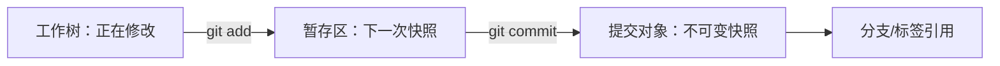

# 2. Git：快照 DAG 与协作冲突

## 不是文件同步器：提交、引用和工作树

Git 把一次提交视为一组文件快照加上父提交、作者、消息等元数据。分支（branch）是指向某个提交的可移动引用；标签（tag）通常用于给重要提交命名。工作树、暂存区和提交对象是三个不同状态：



**不变量**：`git status` 报告的是工作树和暂存区相对当前提交的差异；提交后工作树不自动等于“已经发布”，推送只是把对象和引用发送到远端。理解这个边界，才能区分“本地有提交”“远端有提交”“CI 已验证”和“已发布”。

## 分支策略是变化管理，不是仪式

- 小团队/个人：短分支 + 小提交 + 主分支必须可构建，成本低。
- 多团队：按功能/风险拆分，合并前需要测试、代码审查和资产冲突约定。
- 长期分支：适合发行线或平台稳定线，但要承担回迁、漂移和安全修复成本。
- `rebase` 改写提交父关系，适合整理尚未共享的本地历史；已共享历史通常优先 `merge` 或 `revert`，避免让他人引用失效。

提交信息应描述可验证的变化，例如 `Fix seeded room build manifest`，不要使用 `update`。一个好的提交能被单独构建、测试、审查或回滚；不是把一天所有改动压成“终于能跑”。

## 合并冲突的本质

文本冲突只是 Git 无法决定两个变更的语义。Unity 场景/预制体和 UE 二进制资产可能没有可读的三方合并结果；此时解决方案可能是锁定、分工、拆分资产、改用文本序列化、选择一方后手工重做，或让领域负责人确认。

恢复路径：

```bash
git status
git diff --merge
git merge --abort        # 还没准备好解决时撤销这次合并
git revert <commit>       # 已共享历史的安全回退：产生新提交
git log --graph --oneline --decorate --all
```

不要用 `git reset --hard` 代替理解；它会丢弃未保存工作，只有在明确知道数据不需要时才使用。

## 大文件与生成文件

- 源码/配置/文本资产：普通 Git，方便 diff、审查和回滚。
- 大型二进制资产：考虑 Git LFS 或 Perforce，并测试新成员 clone、离线、配额和恢复。
- 缓存/构建输出/本机设置：写入 `.gitignore`，并用冷构建证明它们确实可再生。
- `.gitignore` 不是安全边界：密钥即使被忽略也可能已经进入历史；发布仓库前要检查历史和 CI 日志。

## 验证：把 Git 当作诊断工具

`git bisect` 要求你能把版本判为 good/bad；如果测试依赖网络、未固定随机种子或使用脏工作树，二分结果会失真。对肉鸽游戏，把 `seed`、内容版本和输入脚本写入回归命令，才能让“这个提交开始房间生成坏了”成为可验证命题。

```bash
git switch -c repro/seeded-room
git add .
git diff --cached --check
git commit -m "Add deterministic room smoke test"
# 出现回归后：
git bisect start
git bisect bad
git bisect good <known-good-tag>
# 每一步运行同一条无交互测试命令
git bisect reset
```

!!! warning "失败模式"
    绿色 CI 不等于历史健康：如果 CI 只测编译，不测产物启动、种子复现、资产完整性或构建清单，回归仍可能被合并。
