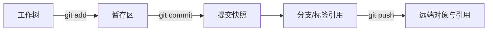

# 3. Git：快照、引用与可审查协作

## Git 记录的不是“文件同步状态”

一次提交是项目文件的快照、父提交和提交元数据；分支是指向提交的可移动引用；标签通常给稳定版本命名。工作树、暂存区和提交对象是三种不同状态：



- `git add` 选择下一次快照，不是“保存到远端”；
- `git commit` 在本地建立可回看的历史，不代表 CI 通过；
- `git push` 传送对象和引用，不代表已发布；
- CI、artifact、部署是另外的状态，需要独立证据。

## 提交为什么要小而完整

一个适合游戏项目的提交应尽量满足：

1. 目的单一：修输入、加 manifest、改房间算法不要混成一个提交；
2. 可构建/可测试：至少能运行与改动相关的检查；
3. 可回退：撤销它不会牵连无关功能；
4. 可解释：提交消息说清验证过什么。

“小提交”不是机械限制行数，而是降低审查、二分和回滚的耦合成本。

## 合并、rebase、revert 的边界

| 操作 | 主要作用 | 共享历史中的风险 |
|---|---|---|
| merge | 把两条历史合成一个新提交 | 可能需要解决语义冲突，但不改写已有提交 |
| rebase | 把提交重新放到另一基线 | 改写提交 ID；已共享历史会让他人引用失效 |
| revert | 新增一个抵消旧变化的提交 | 历史保留，通常是主分支安全回退首选 |
| reset | 移动当前引用 | `--hard` 可能丢未保存工作；远端使用需极谨慎 |

共享主分支已包含坏提交时，通常使用：

```bash
git pull --ff-only
git revert <bad-commit>
python3 -m unittest discover -s knowledge-sets/toolchain-and-git/code/repro-game/tests -v
git diff --check
git push
```

如果坏提交包含密钥或法律上必须从历史移除，普通 revert 不够，需要专门的历史清理、凭据轮换和团队协调。

## 冲突不是“选左边还是右边”

文本冲突只是工具无法推断语义；Unity 场景、预制体、UE 二进制资产可能没有可靠的三方合并。解决顺序应是：

1. 先确认两边意图和资产负责人；
2. 优先拆分大文件、启用可读序列化或使用锁定机制；
3. 解决后运行资产导入、引用检查和最小游戏测试；
4. 记录为什么选择某一版本，而不是只让冲突标记消失。

## Git 作为回归工具

`git bisect` 要求每个中间提交都能被稳定地判为 good/bad。测试若依赖时间、网络、未固定 seed、脏工作树或隐藏缓存，二分结果会失真。不可判定提交可以 `skip`，但要降低结论强度。

```bash
git bisect start
git bisect bad
git bisect good <known-good-tag>
git bisect run python3 -m unittest discover -s tests -v
git bisect reset
```

## 小检查

- [ ] 我能区分工作树、暂存区、提交、远端、CI 和发布；
- [ ] 我能解释为什么共享历史默认 `revert` 而不是强推；
- [ ] 我能写出冲突后的验证命令；
- [ ] 我能说明 bisect 的稳定性前提。
