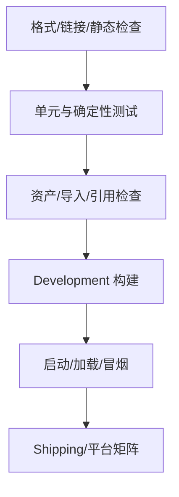

# 5. 构建与测试：把成功变成证据

## “编辑器能打开”只是一层检查

构建验证应从便宜到昂贵分层：



每层都应有明确退出码和失败证据。不要让昂贵的打包步骤承担所有低成本错误。

## 构建入口的四个职责

一个可审查的构建脚本至少要：

1. **校验输入**：源码存在、版本和 seed 合法、依赖可用；
2. **清理输出**：避免旧文件让新构建“假成功”；
3. **按稳定顺序生成**：避免无序遍历、绝对路径和当前时间污染输出；
4. **写入身份**：提交、版本、工具、配置、seed、输入哈希、命令和结果路径。

实践中的 `build.py` 是最小实现：复制源码到 `dist/`，计算 SHA-256，写 `build-manifest.json`。真实 Unity/UE 还会增加平台、符号、插件、资产包和许可证信息，但不改变职责边界。

## 测试不只验证“函数返回值”

游戏工具链至少需要三类测试：

- **确定性测试**：同一 seed 和内容版本得到同一行为/性质；
- **边界测试**：空输入、非法路径、缺失资产、错误版本明确失败；
- **冒烟测试**：产物真的能启动、加载关键场景或执行最小流程。

对肉鸽生成器，不一定硬编码整张地图；更稳妥的是测试不变量：入口和出口存在、房间可达、掉落表版本存在、生成结果可序列化。

## manifest 的字段分层

```json
{
  "deterministic": {
    "commit": "...",
    "tool_version": "...",
    "seed": 42,
    "inputs": [{"path": "...", "sha256": "..."}]
  },
  "provenance": {
    "build_id": "ci-123",
    "started_at": "..."
  }
}
```

确定性字段可用于两次构建比较；来源字段用于追踪哪一次 runner 执行了构建。不要为了保留调试信息而把当前时间和绝对用户路径混入确定性哈希。

## Unity/UE 的实际入口

- Unity：锁定 Editor 和平台模块，使用 batch/headless 参数调用项目内公开的构建方法；测试先执行，构建后做启动/场景冒烟。
- UE：锁定引擎、插件和平台 SDK，用 Automation、命令行或 BuildGraph 入口执行测试/打包；把配置、日志、符号和构建 ID 关联。

具体参数会随版本变化，课程只固定“公开入口、清理输出、明确目标、保存证据”这四个原则。

## Checkpoint B

```bash
cd knowledge-sets/toolchain-and-git/code/repro-game
python3 -m unittest discover -s tests -v
rm -rf dist /tmp/repro-a /tmp/repro-b
python3 src/build.py --output dist --seed 42 --version 1.0.0
cp -R dist /tmp/repro-a
python3 src/build.py --output dist --seed 42 --version 1.0.0
cp -R dist /tmp/repro-b
diff -ru /tmp/repro-a /tmp/repro-b
```

预期：测试通过，差异命令无输出，manifest 可读，`dist/` 只包含预期文件。
