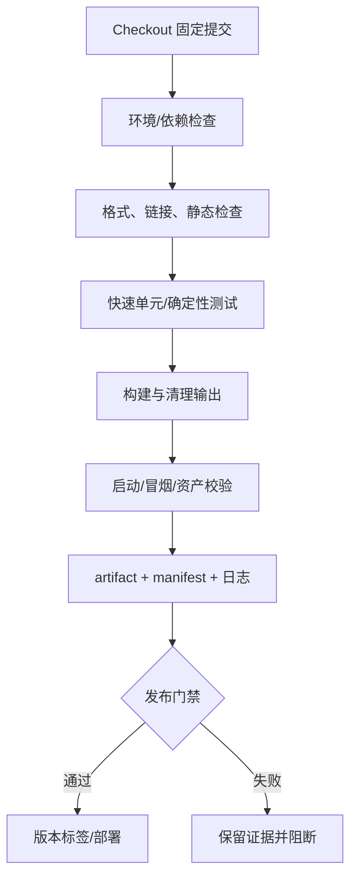

# 5. CI、发布与回滚

## CI 不是另一台“神奇电脑”

持续集成（Continuous Integration, CI）应执行本地已经存在的命令：检查、测试、构建、打包、上传证据。若本地没有清晰入口，先写 CI YAML 只会把混乱搬到云端。

推荐分层：



**缓存与 artifact 的边界**：缓存的目标是加速，可被删除和重新生成；artifact 是本次构建要交付或诊断的输出，应带构建 ID 并保留到足以调查的时间。把 `Library/` 或 `DerivedDataCache/` 上传成“发布包”是概念错误。

## 最小 GitHub Actions 形态

下面只展示概念和仓库自身已有命令；action 版本、权限和保留期必须随仓库锁定并定期复核。第三方 action 应固定到受信任版本/提交，并遵循最小权限原则。

```yaml
name: verify
on:
  pull_request:
  push:
    branches: [main]
permissions:
  contents: read
jobs:
  verify:
    runs-on: ubuntu-latest
    steps:
      - uses: actions/checkout@v6
      - uses: actions/setup-python@v6
        with:
          python-version: "3.12"
      - run: python scripts/sync_docs.py
      - run: python scripts/check_repo.py
      - run: python3 -m unittest discover -s knowledge-sets/toolchain-and-git/code/repro-game/tests -v
      - run: python3 knowledge-sets/toolchain-and-git/code/repro-game/src/build.py --output /tmp/repro-dist --seed 42
```

它不是完整发布工作流：真实 Unity/UE 构建还要安装/选择编辑器、平台 SDK、许可证和秘密，并处理分钟数、缓存、并发、符号、平台矩阵与大文件存储。

## 发布、标签和回滚

- 发布候选来自已通过 CI 的不可变提交；用标签或构建 ID 关联源、产物、manifest、日志和符号。
- 回滚优先重新部署已知良好的旧产物；比“重新构建同名旧版本”更能避免工具/依赖漂移。
- 若必须修复主线，用 `git revert` 产生可审查的新提交；不要在共享分支强推重写历史。
- Pages 部署成功只证明站点 artifact 被部署，不证明课程内容正确；仍要检查生成页面、链接、状态和可见性。

## 安全边界

CI 日志是公开或半公开输出的可能性很高：不要 `echo` 密钥；来自 fork 的不可信代码不能随意获得写权限或生产秘密；工作流权限从 `contents: read` 起步，发布 job 再显式增加 Pages 权限。锁定 action 版本，审查脚本对环境变量和路径的处理。

## 验证清单

```text
[ ] checkout 后不依赖个人目录或本机缓存
[ ] 同一命令可在本地和 CI 运行
[ ] 测试在打包前失败即阻断
[ ] 产物、manifest、日志、测试报告可下载
[ ] cache 与 artifact 语义分开
[ ] 发布有构建 ID/提交/版本标签
[ ] 回滚使用已验证旧产物
[ ] 权限最小，秘密不进仓库和日志
```
