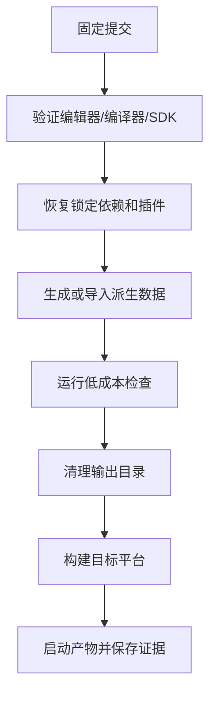

# 6. 构建系统的边界：从源文件到可运行游戏

## 先解决一个看似简单的问题

项目目录里有脚本、场景、贴图、导入缓存、编辑器日志和几个旧的可执行文件。新人问：“哪些应该提交？”如果回答只是列一份 `.gitignore`，问题仍没有解决，因为同一个文件的正确处理取决于它的**角色**、**所有者**和**生命周期**。

本章建立一个比“该不该提交”更稳的模型：

> 对每个路径，先问它是否是构建输入、谁维护它、能否从其他输入再生、失败后是否需要审查或回滚；最后才决定是否进入版本控制。

## 6.1 构建不是一个按钮，而是一条有向数据流

把一次构建抽象为：

```text
提交快照 + 工具链 + 依赖 + 配置 + 平台 + 随机/时间输入
        │
        ├── 导入、编译、转换、链接、打包
        │             │
        │             ├── 测试与检查证据
        │             └── 可运行产物
        │
        └── 缓存只改变速度，不应改变语义
```

**构建输入**是会改变输出语义的东西；**缓存**是为了加速而保存的中间结果；**artifact（产物）**是这一次构建产生的可下载或可部署输出；**provenance（来源证明）**是说明产物从哪里来的证据。四者混在一起，会产生三种典型错误：

1. 把缓存提交后，隐藏依赖被掩盖；
2. 把产物当源文件提交，审查者看不出真正改动；
3. 只上传 zip，不记录提交、工具、平台和命令，之后无法解释差异。

## 6.2 七类工程状态

| 类别 | 定义 | 典型游戏项目例子 | 谁拥有状态 | 生命周期 | 删除后应该怎样 |
|---|---|---|---|---|---|
| 源 source | 人直接维护、需要审查的输入 | C#/C++、Python、场景、材质源、配置 | 开发/内容团队 | 长期 | 从版本控制恢复 |
| 元数据 metadata | 维持身份、引用或导入规则的输入 | Unity `.meta`、GUID、包清单、插件声明 | 工具与项目约定共同拥有 | 与源绑定 | 冷导入时再生或导致引用断裂，必须明确 |
| 工具 toolchain | 执行转换和构建的程序 | 编译器、Unity Editor、UE、SDK、脚本运行时 | 工程/发行团队 | 版本化 | 安装或下载固定版本 |
| 依赖 dependency | 构建要消费的外部包或插件 | UPM 包、NuGet、UE 插件、LFS 对象 | 项目维护者/供应方 | 按版本和校验和 | 按锁文件或镜像恢复 |
| 缓存 cache | 可由输入重新计算的中间结果 | Unity `Library/`、UE `DerivedDataCache/`、编译缓存 | 本机或 CI | 短期 | 删除后冷启动/重建 |
| 产物 artifact | 本次构建输出的可运行或可交付文件 | `.exe`、`.app`、pak、测试报告、符号 | 构建系统/发布系统 | 版本化保留 | 从同一提交重新构建或下载旧 artifact |
| 证据 evidence | 解释构建是否成功及其身份的记录 | manifest、日志、测试结果、崩溃转储 | CI/测试/开发团队 | 与构建绑定 | 不能只保留“绿色”状态 |

表中“拥有者”很重要：工具生成的文件不等于无人负责。Unity `.meta` 是工具生成、项目依赖的元数据；CI 日志是机器产生、开发者依赖的证据。拥有者决定谁负责恢复、审查和变更。

## 6.3 用三个问题判断一个目录

对任何目录，不要先套别人家的忽略文件，先回答：

### 问题 A：它是否改变语义？

删掉后重新生成，如果游戏逻辑、资产引用或构建内容改变，它不是普通缓存。比如 Unity 的 `.meta` 会保存资产 GUID；删除并重新生成可能使场景引用指向丢失对象。相反，`Library/` 的导入结果理论上可从项目输入重新生成，应该被视为派生缓存。

### 问题 B：它是否可审查？

一个 500 MB 的导入数据库即使能改变构建，也不适合直接当作主要审查接口。应回到它的可审查源：配置、导入设置、生成脚本、资产源文件和版本信息。二进制资产仍可能必须交付，但应配合版本、锁定、校验和恢复演练。

### 问题 C：它是否能从干净 checkout 恢复？

“我本机有这个目录”不是恢复策略。恢复路径必须写成命令：安装工具、拉取依赖、导入资产、运行测试、生成产物。如果某个目录删掉后没有恢复路径，说明它不是单纯的缓存，或者工程边界还没有被写清楚。

## 6.4 从失败场景反推边界

### 失败一：提交 `Library/` 后第一次打开很快，第三次改包却出现旧行为

可能发生的机制是：本机缓存包含旧包的导入结果，编辑器优先复用它；版本控制只更新了源和部分缓存，团队成员得到不同的中间状态。缓存让问题更快出现，也让问题更难解释。

**验证**：在临时 clone 中删除 `Library/`，固定编辑器和包版本，重新导入，再比较关键资产哈希和测试结果。若冷导入与热启动的语义不同，应修复导入依赖或脚本，而不是提交缓存。

### 失败二：产物能运行，但不知道它来自哪个提交

可执行文件只描述“能运行”，不描述“为什么是这个版本”。没有 manifest，测试人员无法知道它使用的引擎、平台 SDK、内容版本和构建命令。

**修复**：把身份写进独立 manifest，并让上传的产物与 manifest、日志、测试报告共用一个 build ID。manifest 不是安全证明，也不是完整 SBOM；它首先是可诊断的来源索引。

### 失败三：`.gitignore` 以为已经解决密钥泄露

忽略规则只影响未来未追踪文件，不会删除已经提交到历史中的密钥。正确处理需要撤销暴露凭据、清理历史（若确有必要）并检查日志、artifact 和缓存副本。

## 6.5 Unity 与 Unreal 的同一原则

### Unity

通常把 `Assets/`、`Packages/`、`ProjectSettings/` 和随资产管理的 `.meta` 当成项目输入；`Library/`、`Temp/`、`Obj/`、本地日志和本地产物通常是可再生状态。文本序列化能改善审查，但不能保证两个场景文件的语义冲突可以自动解决。

### Unreal Engine

通常把 `.uproject`、源码、`Config/`、Content、插件声明与插件源作为输入；`Binaries/`、`Intermediate/`、`Saved/`、`DerivedDataCache/` 通常是派生状态。UE 项目的“能打开”还依赖引擎来源、插件、编译器、平台 SDK 和目标配置，因此这些必须进入环境清单或构建 manifest。

### 二进制资产

二进制的核心问题不是“Git 能不能存”，而是：

- 是否需要差异审查；
- 是否需要同时编辑或锁定；
- clone 是否能拿到真实对象，而不是只有 LFS 指针；
- 恢复是否有备份、配额和权限保障；
- 产物能否与资产版本关联。

Git LFS、Perforce 类锁定流程和普通 Git 都是工具选择，不是工程原则。原则是：源、引用、版本、锁定和恢复必须可验证。

## 6.6 一个可执行的边界表

为你的项目填这张表，至少 10 行：

```text
路径 | 类别 | 是否改变语义 | 拥有者 | 生命周期 | 是否提交 | 冷启动验证
Assets/Player.prefab | 源/元数据 | 是 | 玩法团队 | 长期 | 是 | 新 clone 导入并加载场景
Library/ | 缓存 | 理论上否 | Unity | 短期 | 否 | 删除后重新打开项目
Build/Windows/ | 产物 | 是但可再生 | CI | 发布周期 | 通常否 | 下载 artifact 后启动
```

**不要把“是否提交”当成唯一答案。** 更有用的答案是“它如何恢复、如何验证、失败时谁负责”。

## 本章验证

在课程实践目录运行：

```bash
cd code/repro-game
python3 -m unittest discover -s tests -v
rm -rf dist
python3 src/build.py --output dist --seed 42 --version 1.0.0
cat dist/build-manifest.json
```

如果 `dist/` 删除后仍能由 `src/` 生成，说明实践项目至少把源和产物分开了。下一章会继续问：工具、时间、随机和依赖是否也被显式化。

## 6.7 动手：从目录树反推工程边界

下面是一棵很像真实游戏项目、但故意混杂了不同生命周期的目录树：

```text
GameProject/
├── Assets/                  # Unity 源资产与场景
├── ProjectSettings/         # Unity 项目设置
├── Packages/                # 包声明与锁文件
├── Library/                 # 编辑器导入缓存
├── Temp/                    # 临时文件
├── Plugins/                 # 第三方插件（可能含源码和二进制）
├── Content/                 # Unreal 资产
├── Config/                  # Unreal 项目配置
├── Binaries/                # 构建产生的二进制
├── DerivedDataCache/        # Unreal 派生缓存
├── Saved/                   # 日志、崩溃和临时保存
└── Build/                   # 本次平台构建输出
```

不要直接回答“哪些目录写进 `.gitignore`”。先填这张表：

| 路径 | 语义输入？ | 可从公开输入再生？ | 需要审查/回滚？ | 第一反应 |
|---|---:|---:|---:|---|
| `Assets/` / `Content/` | 是 | 否或成本很高 | 是 | 纳入版本控制，按资产协作策略管理 |
| `ProjectSettings/` / `Config/` | 是 | 否 | 是 | 纳入版本控制，审查关键变更 |
| `Packages/` | 是 | 可按声明/锁文件恢复 | 是 | 声明、锁文件和安装前提一起管理 |
| `Library/` / `DerivedDataCache/` | 通常否 | 是 | 通常否 | 作为可失效缓存，不把它当恢复前提 |
| `Temp/` / `Saved/` | 否或混合 | 是 | 只有诊断文件例外 | 忽略；需要的报告单独作为 artifact |
| `Build/` / `Binaries/` | 是构建结果，不是源 | 是或可下载旧 artifact | 发布时需要 | 不进源码仓库；发布系统保存可追踪 artifact |

“通常”不是偷换概念：某些插件会把不能自动恢复的二进制放进项目，某些生成配置需要审查。最终判断仍然要回到**来源、恢复命令、许可证和责任人**。

## 6.8 写一个可审查的忽略规则

`.gitignore` 的任务是减少误提交，不是替项目定义真相。规则应该与构建边界一起审查：

```gitignore
# 可再生缓存与临时目录
Library/
Temp/
DerivedDataCache/
Saved/

# 本地/平台构建输出
Build/
Binaries/

# Python 实践的临时结果
__pycache__/
dist/
```

验证规则不能只看文件名：

```bash
git check-ignore -v Library/Import.db Build/game.zip

git status --short --ignored
```

如果一个应该提交的插件被规则误伤，`git check-ignore -v` 会指出是哪条规则匹配。若只是用 `git status` 看到“没有变化”，并不能证明文件没有被忽略；它可能根本没有进入审查范围。

## 6.9 构建图与恢复路径

把“全新机器能构建”写成一个有顺序的图，而不是一句口号：



图中最容易被遗漏的是 `B` 和 `C`：如果没有明确的工具版本、平台模块、包锁、插件来源和许可证前提，后面的构建命令只是把失败推迟。对 Unity，恢复路径通常围绕 Editor、`Packages/manifest.json`、`Packages/packages-lock.json`、项目设置和脚本化构建；对 UE，通常还要加入引擎来源、插件、编译器、目标 SDK 和项目生成步骤。课程不把某个目录名当作跨版本保证，而是要求能证明“删除派生目录后仍能恢复”。

### 本节验收

对自己的项目或实践代码写出一张七类边界表，并用三条命令证明它不是口头分类：

```bash
git status --short --ignored
git check-ignore -v <一个缓存路径>
find . -maxdepth 2 -type f | sort | head -80
```

验收标准：每个被忽略的目录都有恢复方式；每个被提交的目录都有所有者和审查理由；构建输出能通过提交、manifest 或 artifact ID 找回来源。


## 本章练习

### T06-Q1：缓存还是源码

目录含 `Assets/`、`.meta`、`Library/`、`Build/`、manifest。哪些应提交，如何证明？

<details><summary>最小提示</summary>

按源、元数据、依赖、缓存、产物、证据分类。
</details>

<details><summary>讲解与验证</summary>

Assets 和维持 GUID 的 `.meta` 通常是输入；Library 是可再生缓存；Build 是产物；manifest 是构建证据，随 artifact 保存。删除缓存后冷导入并构建，若仍能恢复才支持忽略。常见错误是把所有自动生成文件都忽略。游戏映射：错误忽略 `.meta` 会断资产引用。
</details>

### T06-Q2：把证据写出来

请为本章主题列出一个最小可执行验证，并说明预期结果和失败后的下一步。

<details><summary>最小提示</summary>

不要只写“运行一下”；写出输入、命令、观察对象和判定条件。
</details>

<details><summary>讲解与验证</summary>

合格验证应固定输入并记录命令、退出码、变更的 Git 状态或构建产物；预期结果必须可观察，失败时能缩小到一个阶段或不变量。若结果受时间、网络、缓存或未提交工作影响，应先隔离这些变量。常见错误是只看屏幕上的成功文字，不检查退出码、diff、artifact 或清理后重建。游戏映射：工程质量来自可重复证据，而不是一次“看起来能跑”。
</details>
