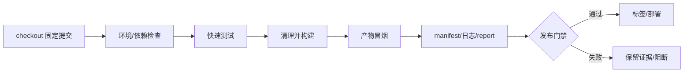

# 7. CI、发布与回滚：让证据跟着产物走

## CI 是命令执行器，不是神秘环境

持续集成（Continuous Integration, CI）应执行本地已经存在的命令：检查、测试、构建、冒烟、上传证据。如果本地没有清晰入口，先写 YAML 只会把混乱搬到云端。

最小分层：



## cache、artifact、release 的区别

- **cache**：加速数据，可删除、可失效、不能作为发布真相；
- **artifact**：本次构建的可下载输出和诊断材料，应带构建 ID；
- **release/deployment**：把已验证 artifact 暴露给玩家或 Pages，必须能关联提交和回滚版本。

把 Unity `Library/` 或 UE `DerivedDataCache/` 上传成发布包是概念错误；把没有 manifest 的 zip 交给测试人员则无法追踪来源。

## GitHub Actions 最小形态

```yaml
name: verify
on:
  pull_request:
  push:
    branches: [main]
permissions:
  contents: read
jobs:
  verify:
    runs-on: ubuntu-latest
    steps:
      - uses: actions/checkout@v6
      - uses: actions/setup-python@v6
        with:
          python-version: "3.12"
      - run: python scripts/sync_docs.py
      - run: python scripts/check_repo.py
      - run: python3 -m unittest discover -s knowledge-sets/toolchain-and-git/code/repro-game/tests -v
      - run: python3 knowledge-sets/toolchain-and-git/code/repro-game/src/build.py --output /tmp/repro-dist --seed 42
```

真实 Unity/UE workflow 还需处理 Editor/Engine 安装、平台 SDK、许可证、并发、缓存、符号、平台矩阵和大文件存储；这些是增加的输入，不是可以省略的输入。

## 发布和回滚

1. release candidate 来自已通过 CI 的不可变提交；
2. 标签、构建 ID、manifest、产物、日志和符号互相可追踪；
3. 回滚优先重新部署已知良好的旧 artifact，而不是用今天的工具重建旧版本；
4. 主线修复优先用 `git revert`，不在共享分支强推；
5. Pages 部署成功只证明站点 artifact 部署，不证明内容质量，所以仍需本地检查和浏览器复查。

## 安全边界

默认 `contents: read`；测试 job 不应拥有发布权限；来自 fork 的不可信代码不能读取生产密钥；第三方 action 固定到受信任版本/提交；日志不能打印环境变量、token 或用户绝对路径。排错靠 manifest、测试报告、日志和符号，不靠“给所有 job 写权限”。

## 发布清单

```text
[ ] checkout 不依赖个人目录或本机缓存
[ ] 本地和 CI 使用同一命令
[ ] 测试在打包前失败即阻断
[ ] 产物、manifest、日志、报告可下载
[ ] cache 与 artifact 语义分开
[ ] 构建 ID 关联提交和版本标签
[ ] 回滚使用已验证旧产物
[ ] 权限最小，秘密不进仓库和日志
```
