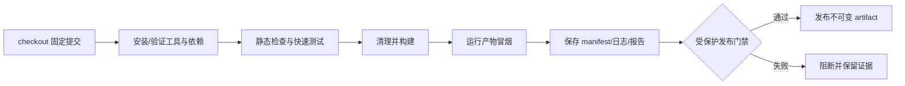

# 9. CI、发布与回滚：让证据跟着产物走

## 9.1 CI 不是另一套神秘工程

CI（Continuous Integration，持续集成）最有价值的第一步，是执行本地已经存在、开发者能够复制的命令：检查、测试、构建、冒烟和证据上传。如果本地没有清晰入口，先写 YAML 只会把混乱搬到云端。

最小流水线：



CI 的职责是给出证据，不是把所有开发者权限复制给 runner。

## 机制

CI 把固定提交转换为可验证 artifact，再由受保护的发布步骤引用这个已验证身份；cache 只优化中间过程，不能替代来源和测试证据。回滚时移动的是发布指针或选择旧 artifact，不是把共享历史强行改写成过去。


## 9.2 cache、artifact、release 三者边界

| 名称 | 目的 | 能否删除 | 是否交付真相 | 游戏例子 |
|---|---|---:|---:|---|
| cache | 加速下一次任务 | 可以 | 否 | Unity `Library/`、UE `DerivedDataCache/` |
| artifact | 保存本次构建输出和诊断材料 | 不应随意丢失 | 是，需与构建身份绑定 | 包、符号、manifest、测试报告 |
| release/deployment | 把已验证版本暴露给玩家或网站 | 需按版本管理 | 是发布状态 | 商店包、Pages 部署、测试渠道 |

把缓存上传成发布包会让人误以为它是可运行产品；把没有 manifest 的 zip 交给测试人员，则无法追踪来源。artifact 应至少关联提交、版本、构建 ID、目标平台和校验信息。

## 9.3 一个最小 GitHub Actions 形态

```yaml
name: verify

on:
  pull_request:
  push:
    branches: [main]

permissions:
  contents: read

jobs:
  verify:
    runs-on: ubuntu-latest
    steps:
      - uses: actions/checkout@v6
      - uses: actions/setup-python@v6
        with:
          python-version: "3.12"
      - run: python scripts/sync_docs.py
      - run: python scripts/check_repo.py
      - run: python3 -m unittest discover -s knowledge-sets/toolchain-and-git/code/repro-game/tests -v
      - run: python3 knowledge-sets/toolchain-and-git/code/repro-game/src/build.py --output /tmp/repro-dist --seed 42
      - run: python3 /tmp/repro-dist/game.py --seed 42
```

这段 YAML 不是通用版本承诺。真实 Unity/UE workflow 还需要 Editor/Engine 安装、平台模块、许可证、插件、LFS/Perforce、缓存键、并发、符号和平台矩阵。课程真正固定的是：CI 使用项目公开命令，并在失败时返回非零退出码和可下载证据。

## 9.4 权限与不可信输入

最小权限原则意味着：

- 默认 `contents: read`；
- 测试 job 不拥有发布权限；
- 来自 fork 的代码不能读取生产密钥；
- 第三方 action 固定到受信任版本或提交并定期审查；
- 日志不得打印 token、环境变量、用户绝对路径或未脱敏配置；
- deploy job 只接受受保护分支或已批准 artifact。

“为了方便排错给所有 job 写权限”把诊断问题变成供应链风险。更好的排错材料是 manifest、日志、测试报告、崩溃转储、符号和构建输入摘要。

## 9.5 发布不是重新构建一次

发布候选版本应来自已经通过门禁的不可变提交和 artifact。理想关系：

```text
commit abc123
   └── CI run 1842
         ├── manifest
         ├── test report
         ├── package sha256
         └── release candidate 1.0.0
```

如果发布时又在另一台机器“重新打一个差不多的包”，你失去了测试与玩家拿到的文件之间的身份关系。对需要回滚的版本，优先重新部署已验证旧 artifact，而不是今天用不同工具重建过去。

## 9.6 回滚的两种层次

### 代码层回退

共享主线上的坏提交通常用 `git revert`，保留历史并生成可审查的修复提交。

### 发布层回滚

玩家已经拿到坏包时，优先切换到上一个已验证 artifact。代码仓库回退与线上包回退不是一回事：仓库可以前进一个“回滚提交”，线上仍然部署旧包；或者发布系统直接重新指向旧 artifact。

如果坏版本涉及存档格式、在线协议或数据库迁移，回滚前还要考虑向后兼容、数据备份和迁移脚本，不能只替换可执行文件。

## 9.7 课程的发布清单

```text
[ ] 干净 checkout 不依赖个人目录或预热缓存
[ ] 本地和 CI 使用同一构建入口
[ ] 测试失败会阻断构建
[ ] 产物、manifest、日志、报告可下载
[ ] cache 与 artifact 语义分开
[ ] build ID 关联提交、版本和目标平台
[ ] 发布使用已验证 artifact
[ ] 回滚路径和旧 artifact 已知可用
[ ] job 权限最小，秘密不进仓库和日志
[ ] Unity/UE 的引擎、插件、SDK 和许可证前提已记录
```

## 本章综合验证

在本课程实践中，先本地执行：

```bash
make test
make build SEED=42 VERSION=1.0.0
make run SEED=42
```

然后把相同命令映射到 CI。最后问三个问题：

1. CI 失败时，能下载什么证据？
2. 测试通过的 artifact 与发布给玩家的文件是否是同一个？
3. 如果今天的构建环境坏了，能否直接部署上一个已验证版本？

答不出其中任何一个，说明流水线仍然只是在“执行命令”，还没有形成可交付系统。

## 9.8 从本地命令到 CI job：不要复制粘贴秘密

一个好的 workflow 只是把公开的本地入口编排起来。示例：

```yaml
name: verify

on:
  pull_request:
  push:
    branches: [main]

permissions:
  contents: read

jobs:
  verify:
    runs-on: ubuntu-latest
    steps:
      - uses: actions/checkout@v6 # 版本以项目锁定和官方文档为准
      - uses: actions/setup-python@v6
        with:
          python-version: "3.12"
      - run: make test
      - run: make build SEED=42 VERSION="ci-${{ github.sha }}"
      - run: make run SEED=42
      - uses: actions/upload-artifact@v4
        with:
          name: repro-game-${{ github.sha }}
          path: |
            knowledge-sets/toolchain-and-git/code/repro-game/dist/
```

示例刻意没有把 token、个人目录或“万能发布权限”写进 job。action 主版本、Python 版本、runner 镜像和上传策略都应由项目锁定并定期复核；这里教学的稳定部分是：CI 执行同一入口、失败返回非零、artifact 与提交绑定。真实 Unity/UE workflow 还要处理编辑器/引擎安装、平台模块、许可证、插件、LFS/Perforce、缓存键和平台矩阵。

## 9.9 cache key 为什么要包含输入身份

缓存键至少要能区分会改变派生结果的输入：

```text
<os>-<engine-version>-<target>-<lockfile-hash>-<project-input-hash>
```

如果只用 `ubuntu-latest-unity`，包升级后 runner 可能复用旧导入结果；如果把提交 SHA 直接放进所有缓存键，缓存命中率会很差。常见取舍是：用工具版本 + 锁文件 + 相关项目输入作为主键，再用较宽的恢复前缀作为只读近似缓存。无论如何，冷构建必须定期运行，以证明 cache 不是隐式必需品。

## 9.10 发布与回滚 runbook

发布流程可以缩成一张可执行的 runbook：

```text
1. 选择已通过门禁的提交和 artifact ID
2. 核对 manifest：提交、目标平台、版本、输入哈希、测试报告
3. 对包计算并记录校验和
4. 部署同一个 artifact，不在发布阶段重新构建
5. 做最小启动/加载/关键输入冒烟
6. 记录发布时间、状态和回滚目标
7. 发现阻断级问题时，切换到上一个已验证 artifact
```

如果坏版本包含存档格式、在线协议或数据库迁移，单纯替换可执行文件可能还不够；必须核对向后兼容、数据备份和迁移脚本。代码层的 `git revert` 与发布层的 artifact 回滚解决不同问题：前者让主线恢复可继续开发，后者让玩家尽快回到已验证版本。

## 9.11 Unity/UE 的同一原则

| 工程问题 | Unity 常见实现 | Unreal 常见实现 | 不变原则 |
|---|---|---|---|
| 无交互入口 | Editor batch/headless + 脚本化 BuildPipeline | 命令行参数、Automation、BuildGraph | 入口公开、退出码明确 |
| 派生缓存 | `Library/` | `DerivedDataCache/`、`Intermediate/` | 可删除、可恢复、不等于发布包 |
| 资产恢复 | `.meta`、包锁、序列化设置 | `Config`、插件、内容源、目标 SDK | 身份和依赖必须可追踪 |
| 发布证据 | 包、符号、日志、manifest | 包、符号、日志、manifest | artifact 绑定提交和目标 |

这些是跨版本的边界模型，不是承诺所有项目使用同一命令或目录。遇到版本差异，优先查当前项目和官方稳定文档，再更新环境清单。

### 本节验收

为自己的项目画出三个 job：`verify`、`build`、`release`。给每个 job 写所需权限、输入、输出和失败证据；如果一个 job 同时拥有测试、生产密钥和部署写权限，先拆开再继续。


## 本章练习

### T09-Q1：设计发布回滚表

为一个平台构建列出提交、工具版本、build ID、artifact、测试证据和回滚目标。

<details><summary>最小提示</summary>

发布身份要能从包反查源和验证结果。
</details>

<details><summary>讲解与验证</summary>

manifest 至少关联 commit、平台、工具版本、内容版本、seed/测试摘要和 artifact hash；回滚选择已验证旧 artifact，并检查存档/服务兼容。不要以 `reset` 代替线上回滚。验证冷启动和产物 hash。游戏映射：玩家获得的是已验证包，不是开发者本机目录。
</details>

### T09-Q2：cache、artifact 和 release 不能互换

CI 运行很慢，团队提议“把最后一次构建目录作为 cache，发布时直接拿 cache”。请判断这个方案的问题，并设计正确的数据流。

<details><summary>最小提示</summary>
cache 允许失效和重建，artifact 必须可下载审查，release 代表已经批准的身份。
</details>

<details><summary>讲解与验证</summary>

依赖/编译缓存可以按输入身份复用，但失效后必须能重建；构建成功后应上传带 hash 和 manifest 的不可变 artifact；发布 job 只下载并验证该 artifact，再创建 release 或平台上传，不要重新构建，也不要把未验证 cache 当包。边界是 cache 命中不能证明内容来自当前提交，artifact 也不自动获得发布资格；验证比较 commit、manifest、hash 和测试 run ID，并在删除 cache 后重跑确认恢复路径。常见错误是使用 `latest` 路径覆盖旧包，或把缓存权限暴露给不可信 PR。游戏映射：玩家获得的版本必须能回溯到已经测试过的同一包，才能安全热修复和回滚。
</details>

### T09-Q3：回滚代码前先检查存档兼容

线上新版本引入了存档 schema v3，代码有严重战斗 bug。请说明回滚到 v2 artifact 前必须检查什么，以及不兼容时的替代方案。

<details><summary>讲解与验证</summary>

先确认 v2 是否能读取已经由 v3 写出的存档，检查迁移方向、字段默认值、枚举变化和是否存在不可逆数据；用真实版本样本和损坏样本在隔离目录做读写回归，再决定回滚。若 v2 不能读取，应优先发布兼容修复/前向迁移工具、禁用高风险存档写入或保留兼容读取层，而不是直接切换旧包。边界是代码回滚、内容回滚和数据回滚可能是三个不同动作；常见错误是只验证程序能启动，不验证继续游戏。游戏映射：肉鸽存档、配置版本和在线服务数据需要独立的兼容契约，发布回滚不能只看 git 历史。
</details>
