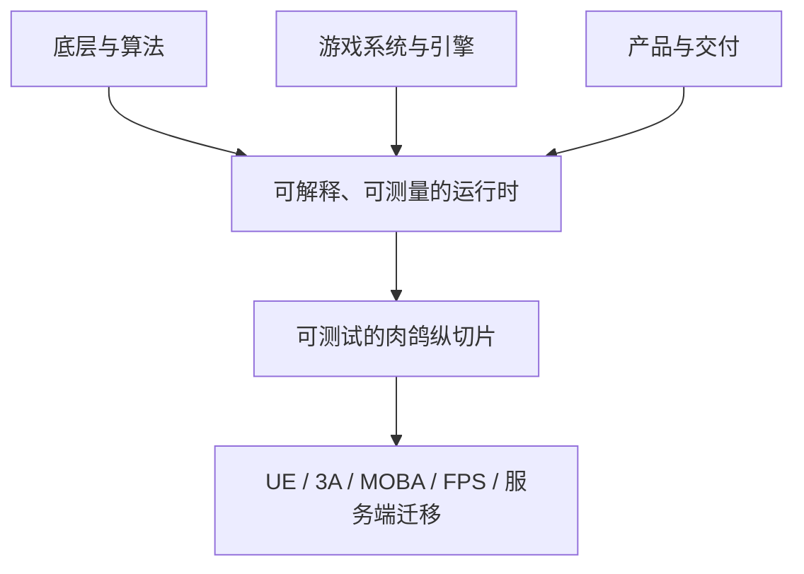

# 学习路线总览

## 最终能力

学习完成后，应能独立完成以下工作：

- 从数据结构、内存、并发、网络和渲染机制解释游戏代码为何正确、快速或失效；
- 在 Unity 或 Unreal Engine 中构建边界清晰的战斗、AI、UI、存档、资源和工具系统；
- 诊断帧循环、输入、碰撞、动画、网络同步、性能和构建问题；
- 用命名、模块边界、数据驱动、测试、日志、版本控制和 CI 控制规模增长；
- 完成并发行一个范围受控的 2D 肉鸽动作游戏纵切片。

## 三条并行能力线

| 能力线 | 核心问题 | 代表课程 |
|---|---|---|
| 底层与算法 | 为什么正确、快、稳 | C、数学、数据结构、算法、组成、操作系统 |
| 游戏系统与引擎 | 如何把规则变成可扩展玩法 | OOP、软件工程、图形、AI、引擎、Unity/UE |
| 产品与交付 | 如何从原型走到可发行产品 | 工具链、数据、网络、调试、测试、构建与发行 |

三条线交叉推进，不需要先学完所有理论再碰引擎，也不应只做引擎功能而跳过底层验证。

## 深度分级

- **D3 深入掌握**：能推导/解释机制、实现简化版、测量成本、处理失败并迁移；核心课程允许 12–20 个连续知识单元；
- **D2 熟练应用**：能理解原理、正确使用工具、完成实验、诊断常见失败并迁移；
- **D1 建立地图**：能说明边界、用途和继续深入的触发条件。

深度决定证据强度和必要篇幅，不以章节少为优先。D3 的 C、线性代数、数据结构、软件工程和 AI 课程必须把核心难点拆开教，不能用一页提纲替代教材式讲解。

## 阶段与出口

| 阶段 | 主题 | 主要出口 |
|---:|---|---|
| 0 | 工具链、Git、构建、调试 | 从全新环境复现一个最小游戏工程 |
| 1 | C 与游戏数学 | 理解内存和数据；用数学表达运动与随机 |
| 2 | 数据结构、算法、OOP | 构建可测试的运行时与玩法模块 |
| 3 | 组成、操作系统、软件工程 | 用测量和工程边界解释帧预算与规模增长 |
| 4 | 数据库与网络 | 设计存档、内容数据与多人通信原型 |
| 5 | 图形与资源 | 理解画面生成和资源管线成本 |
| 6 | 编译、语言、机器学习、LLM、游戏 AI 与引擎架构 | 从模型基础到 Transformer、游戏 AI 和小型引擎系统 |
| 7 | Unity 肉鸽纵切片 | 完成 10–15 分钟可重复游玩的核心循环 |
| 8 | UE、在线服务、优化与工具 | 把能力迁移到更大型的工程约束 |
| 9 | 发行与毕业项目 | 打包、上架、发布并维护 v1.0 |

### 何时进入下一阶段

不要求填写进度表。用三项快速抽检判断：

1. **能解释**：脱离材料说明关键机制和一个边界；
2. **能验证**：运行一个实现、测试或测量并解释结果；
3. **能迁移**：说明它如何影响主项目中的一个具体决策。

明显缺一项时，补一个诊断题或微实验即可，不需要重学整门课。

## 引擎策略

- **Unity 主线**：快速验证 2D 肉鸽玩法、内容迭代和工具工作流；
- **Unreal Engine 副线**：完成 Unity 纵切片后重建一个系统，理解 C++/蓝图、模块化、反射与网络框架；
- **无引擎实验**：算法、内存、并发、网络和数据工具优先使用最小程序或模拟器，以降低验证成本。

## 内容取舍

课程正文优先机制、推导、边界、反例、实验和工程取舍。图表、图标和交互只有在能降低理解成本时才加入；装饰不能挤占知识与实践质量。

## 实践主线的更新

课程实践现在围绕一个学习者自己的 `RogueSlice` 主仓库逐步构筑，但不把所有课程强行变成 Unity 作业：低层与理论课优先用可复现的小程序、库、fixture 和基准；机器学习与 Transformer 课程先做独立、可测量的小模型，再以适配器进入 AI 旁路；生成式 AI 课程重点验证数据许可、评估、缓存和回退；游戏 AI、引擎、数据库与资源课程逐步接入 Unity；网络课程保留旁路服务；UE 课程单独做迁移对照。每门课程只交付一个明确接缝，并可以下载整理好的实践代码。详见[实践主线](practice-system.md)、[共享项目契约](roguelite-project-contract.md)和[实践包与下载](practice-bundles.md)。

## 当前建设状态

路线覆盖面已经完整，但课程内容并未全部发布：截至 **2026-08-23**，27 门课程中只有工具链与 Git已完成，其余 26 门仍处于准备中。不要把课程总览、课程索引或自动检查通过误认为已经学完全部知识。

- [知识集现状审计与优化方案](knowledge-set-audit.md)：查看内容完成度、主要风险、核心主线和拓展分支；
- 学习基础纵切片时，优先沿“核心主线”推进；支撑课程按项目问题插入，方向拓展不阻塞单机主线；
- 课程生成仍按索引 `order` 一门一门推进，下一门是 C 程序设计；路线分层只改变学习者的取舍，不跳过课程自身的质量门禁。
