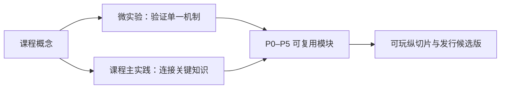

# 实践体系：少而精、可持续演进

## 设计原则

实践不按课程各做一个孤立“作业”，而是分成三个可复用层：

- **微实验**：通常 15–45 分钟，只验证一个机制；
- **课程主实践**：通常 2–6 小时，把本课的关键知识连成一个可验收结果；
- **P0–P5 主线**：承接更大的工作，并持续演进为可发行的“小以撒”纵切片。

“每门课最多 1 个主实践 + 2 个微实验”是上限，不是配额；正文中的小验证不必包装成独立实验。超过 6 小时的工作拆成可验收切片挂到 P0–P5，不另造平行项目。

公开实践提供题面、约束、运行方式、验收标准，以及可折叠的提示、参考路线、验证、常见失败和替代方案。个人实现放在学习者惯用位置；若在本仓库中工作，按需使用被忽略的 `.practice/<course-slug>/`。只有经脱敏、补齐许可证和复现说明的通用参考实现才进入公开 `code/`。不要求实验报告或决策日志。

## 六个主实践

### P0：可复现的 C/C++ 游戏工具箱（无引擎）

**目标**：把 C、OOP、数据结构、CMake、Git、调试、测试变成可复用基础设施。

建议模块：动态数组、哈希表、环形队列、对象池、随机数服务、日志、计时器、JSON/文本配置读取（可使用成熟库，但要理解边界）。

验收：无未定义行为（或能证明风险）、单元测试、Sanitizer/调试器记录、基准测试、跨平台构建说明。

### P1：算法与空间查询实验室（无引擎或轻量窗口）

**目标**：连接离散数学、算法和游戏。

实现并可视化：A*、Dijkstra、网格/四叉树空间索引、优先队列、简单 steering；比较数据规模、障碍密度和启发式对性能/路径质量的影响。

验收：可重复输入、性能表、失败案例（不可达、浮点误差、开放集爆炸）。

### P2：2D 战斗手感实验（Unity）

**目标**：把输入、时间、碰撞、动画事件、相机、反馈、状态和调试工具连起来。

范围：移动、瞄准、攻击、无敌帧、受击、击退、死亡、重启；至少一个可切换的输入映射和一个调试 overlay。

验收：固定时间步与帧率变化下行为可解释；命中判定可视化；输入缓冲与状态转换有测试或可复现实验。

### P3：小以撒核心纵切片（Unity）

**目标**：完成一局 10–15 分钟的可重复循环，而不是堆内容。

最小范围：房间图、房间进入/清空、玩家攻击、3 种敌人、1 个精英/首领、10–15 个道具、道具效果组合、掉落、商店或奖励房、局内升级、暂停/重启、存档/设置、基础音频与反馈。

**关键要求**：

- 随机可用种子复现；
- 道具效果采用数据驱动和可组合的 modifier/effect 机制，避免 `if itemId == ...` 无限增长；
- 规则、表现、输入和 UI 解耦；
- 每次版本限制内容量，优先完成可玩性和可诊断性。

### P4：同一系统的 UE 重建（Unreal Engine）

**目标**：理解 UE Gameplay Framework、C++/蓝图边界、Data Asset、输入、组件、能力/效果与网络意识。

任选 P2/P3 的一个系统重建：输入与状态、能力与效果、敌人 AI、存档/配置或房间生成。必须写出 Unity 与 UE 的概念对应、不可直接对应的部分、何时用 C++、何时用蓝图。

### P5：发行候选版

**目标**：把“能运行”变成“别人能安装并完成一局”。

包括：发布构建、版本号、设置与存档迁移、崩溃/日志、性能预算、输入设备检查、可访问性最小项、商店页面草案、安装说明、已知问题、回滚方案和版本日志。

## 课程与主实践的挂接

| 课程群 | 微实验 | 主实践 |
|---|---|---|
| C/OOP/数据结构/算法 | 容器、对象池、A*、随机性 | P0/P1 |
| 组成/体系/操作系统 | cache 访问、线程队列、计时器、文件 IO | P0/P2 |
| 网络/数据库/软件工程 | 协议模拟、存档 schema、测试矩阵 | P3/P5 |
| 图形/多媒体 | 坐标变换、shader 小效果、音频混音 | P2/P3 |
| AI/编译/程序语言 | FSM、行为树、配置 DSL | P1/P3/P4 |
| 引擎与工程实践 | 资源加载、构建、profile、回归 | P2–P5 |

## 低时间预算的实践决策

当时间不足时，按以下顺序砍内容：美术数量 → 关卡数量 → 敌人变体 → UI 装饰；不要砍：可运行主循环、调试可视化、数据可复现、错误处理、最小测试、打包验证。
