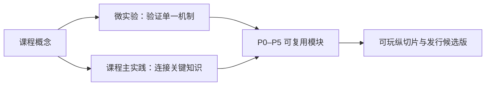

# 实践体系：少而精、可持续演进

> **2026-08 优化版**：课程实践现在按“主项目接缝 + 独立验证载体 + 可下载实践包”组织。不是把所有课程强行改成 Unity 作业，而是让经过验证的结果逐步汇入同一个小以撒纵切片。详见[共享项目契约](roguelite-project-contract.md)和[实践包与下载](practice-bundles.md)。

## 设计原则

实践不按课程各做一个孤立“作业”，而是分成三个可复用层：

- **微实验**：通常 15–45 分钟，只验证一个机制；
- **课程主实践**：通常 2–6 小时，把本课的关键知识连成一个可验收结果；
- **P0–P5 主线**：承接更大的工作，并持续演进为可发行的“小以撒”纵切片。

“每门课最多 1 个主实践 + 2 个微实验”是上限，不是配额；正文中的小验证不必包装成独立实验。超过 6 小时的工作拆成可验收切片挂到 P0–P5，不另造平行项目。

公开实践提供题面、约束、运行方式、验收标准，以及可折叠的提示、参考路线、验证、常见失败和替代方案。个人实现放在学习者惯用位置；若在本仓库中工作，按需使用被忽略的 `.practice/<course-slug>/`。只有经脱敏、补齐许可证和复现说明的通用参考实现才进入公开 `code/`。不要求实验报告或决策日志。

## 五类实践轨道与十个接缝

旧版把所有成果压缩成 P0–P5 六个主实践，容易让“主项目相关”与“课程适合的验证载体”混在一起。现在改为五类轨道：

| 轨道 | 适合课程 | 默认结果 | 是否直接修改 Unity 主项目 |
|---|---|---|---|
| `supporting-lab` 支撑实验 | C、数学、算法、组成、OS、图形 | 小程序、库、fixture、基准或推导验证 | 否；通过导出/适配器消费 |
| `shared-unity` 共享 Unity | 软件工程、数据库、DSL、AI、引擎、Unity 生产、优化 | 一个小功能或工具接缝 | 是，但只改明确目录 |
| `online-sidecar` 联机旁路 | 网络、在线服务 | 本地服务、协议模拟、故障测试 harness | 可选，不阻塞单机主线 |
| `ue-migration` UE 对照 | UE 玩法编程 | 独立 UE 小项目中的系统重建 | 否；保持引擎边界 |
| `shipping` 发行候选 | 发行与毕业 | 主 Unity 项目候选版、安装包和发布证据 | 是，最后冻结 |

主线的十个接缝是：`F0` 可复现工程、`F1` 运行时基础、`F2` 房间与规则、`F3` 战斗空间、`F4` 内容与敌人、`F5` 核心纵切片、`F6` 持久化与资源、`F7` 诊断与性能、`F8` 联机旁路、`F9` 引擎迁移、`F10` 发行候选。每门课程只选择一个主要接缝，不同时开一堆平行项目。

详细的所有权、目录、适配器和回滚规则见[共享项目契约](roguelite-project-contract.md)。

## 主线实践的范围

P0–P5 仍保留为粗粒度里程碑，但它们不再是每门课必须直接修改的“作业”：

- **P0 基础与可复现**：C/OOP/数据结构/工具链形成库、容器、日志、随机和构建接缝；
- **P1 规则与查询**：离散数学、算法、空间查询和生成器形成可复现 room fixture；
- **P2 战斗原型**：数学、图形和引擎课程形成移动、瞄准、攻击、受击与反馈；
- **P3 Unity 纵切片**：软件工程、AI、数据库、资源管线和 Unity 课程把房间、敌人、道具、存档和重启串起来；
- **P4 迁移与在线**：UE 课程重建一个系统；网络课程旁路验证权威、重连和观测；
- **P5 发行候选**：优化、工具和发行课程把主项目变成可安装、可回滚、可诊断的版本。

每个里程碑都要求“独立验证 → 产出契约 → 主项目冒烟”，而不是只提交一个能打开 Unity 的场景。

## 课程与主实践的挂接

课程索引中的 `practiceTrack`、`integrationMode` 和 `projectSlice` 是机器可读的接缝元数据：

- `direct`：实践结果直接进入主项目，但仍需独立测试；
- `adapter`：通过适配器或契约进入，不暴露课程内部实现；
- `export`：只导出数据、库、fixture、基准或算法结果；
- `standalone`：独立引擎迁移项目，不回写 Unity。

具体课程不再用一张静态课程群表决定全部实践；生成课程时必须先读取索引字段，再根据学科问题选择载体和接缝。

## 低时间预算的实践决策

当时间不足时，按以下顺序砍内容：美术数量 → 关卡数量 → 敌人变体 → UI 装饰；不要砍：可运行主循环、调试可视化、数据可复现、错误处理、最小测试、打包验证。
