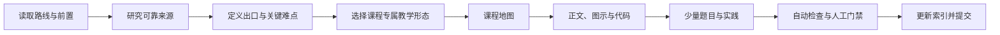

# 课程生成流程

默认一次只生成课程索引中的下一门未完成课程。



## 1. 定位课程

读取 `AGENTS.md`、课程索引、路线、相关标准和前置课程的公开出口。确定学习深度、游戏映射和主项目接口；前置不足时提供一个诊断题或微实验，不依赖个人进度文件。

## 2. 研究

优先官方文档、标准、论文、源码和大学教材。先在 `references/research-notes.md` 记录版本、日期、关键事实、用途、冲突与不确定性；搜索摘要不能直接变成正文。

## 3. 设计课程，而不是套模板

先回答：

- 这门课最难形成的心智模型是什么？
- 哪些内容必须推导，哪些必须测量，哪些必须在引擎里观察？
- 哪一个游戏问题最能暴露本质？
- 哪些章节可以合并，哪些需要拆开？
- 什么内容虽然常见，但对出口能力没有贡献，应删除？

然后完成 `lessons/00-course-map.md`。地图通过后才创建后续章节；不要先批量生成空页面。

## 4. 生成与验证

逐个问题生成正文、必要图示和代码。每个核心概念必须留下定义/边界、机制/不变量、取舍/失败、游戏映射和验证证据，但标题和呈现方式随课程变化。

## 5. 题目与实践

只保留能显著区分“看过”和“理解”的题。默认在课程目录下使用一个 `assessments.md`，把题目、最小提示和折叠解析放在同一页；只有题量很大或协作需要时才拆页。删除没有可判定答案、验证方式或迁移价值的泛泛主观题。实践数量按需要决定，上限为一个主实践和两个微实验。题面先写约束与验收，解法页再提供折叠提示、路线、失败诊断和替代方案。实践必须从课程页面可直接进入，并按 checkpoint 或里程碑给出最小版本。

## 6. 课程内导航与发布

完整课程应在 `mkdocs.yml` 的课程子树中直接列出课程地图、全部正文、实践、题目与参考入口；课程首页可以提供快捷卡片，但不应让学习者依赖多层外部链接才能找到核心内容。

## 7. 门禁与发布

```bash
python3 scripts/sync_docs.py
python3 scripts/check_repo.py
git diff --check
.venv/bin/mkdocs build --strict
```

再人工检查正确性、可复现性、游戏相关性、版本、引用、隐私和视觉可读性。只有实际内容与状态相符时才能改为 `completed`。通过后创建清晰 commit；有授权且远程可用时 push，不使用 `--force`。
