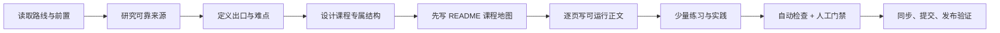

# 课程生成流程

默认一次只生成课程索引中按 `order` 排序的下一门未完成课程，不顺手生成其他课程或空页面。



## 1. 定位与前置

读取 `AGENTS.md`、`roadmap/README.md`、`roadmap/course-index.json`、相关 standards 和前置课程的公开出口。确定深度、游戏映射、主项目接口和可验证出口。前置不足时提供一个诊断题或微实验，不要求学习者填写个人进度文件。

## 2. 研究

优先官方文档、标准、论文、源码和大学教材。先在 `references/research-notes.md` 记录版本、访问日期、关键事实、用途、限制、冲突和不确定性；搜索摘要不能直接变成正文。研究结论只写到来源实际支持的范围，跨版本 API 旁边标注版本边界。

## 3. 先做课程地图，再决定文件

在真正创建章节前，回答：

- 这门课最难形成的心智模型是什么？
- 哪些内容必须推导、实现、测量、诊断或在引擎中观察？
- 哪个游戏问题最能暴露本质？
- 哪些小节必须连续阅读，哪些才值得拆页？
- 哪些常见内容对出口没有贡献，应删除？

将结论写进 `README.md`。`README.md` 同时承担课程首页和课程地图；不再强制 `lessons/00-course-map.md`。

## 4. 生成正文：教学深度优先

逐个可验证问题写正文，而不是先批量创建目录。每个核心知识块至少要让学习者看到：

1. 问题场景或失败现象；
2. 中文/英文术语、定义和边界；
3. 机制模型、不变量或推导；
4. 一个可运行示例、命令、代码或数据；
5. 一个失败案例、反例、取舍或边界；
6. 游戏开发映射（运行时、工具、资源、网络或生产）；
7. 验证方法和预期观察；
8. 延伸方向或何时需要更强工具。

“本节将介绍……”不能代替教学内容；页面必须能帮助初学者从现象走到可执行的验证。不要用统一标题数量限制课程差异。

## 5. 练习与实践

只保留能显著区分“看过”和“理解”的题。默认使用课程目录下的单页 `assessments.md`，题目、最小提示、完整解析、边界、常见错误、验证和游戏映射一一对应；删除没有判定标准的泛泛主观题。

默认使用一个 `practice.md`，把题面、环境、最小版本、参考路线、代码入口、折叠提示、验收、故意失败、常见失败和替代方案合并。最多 1 个主实践 + 2 个微实验；没有独立价值时就把验证合并进正文，不要凑数。

## 6. 导航与维护资料

课程主导航只放：课程与地图、正文、实践、练习题。`references/`、术语表和维护资料默认不进入学习主路径，但应保留可审计链接。课程页面应让学习者不依赖多层外部跳转就能开始学习和验收。

## 7. 门禁与发布

运行：

```bash
python3 scripts/sync_docs.py
python3 scripts/check_repo.py
git diff --check
.venv/bin/mkdocs build --strict
```

再人工检查正确性、可复现性、代码可运行性、游戏相关性、版本、引用、隐私、题答对应、实践验收和视觉可读性。只有正文达到深度门槛并且状态相符时才能标记 `completed`。通过后创建清晰 commit；远程、凭据和授权满足时再 push，不使用 `--force`。

## 5.1 设计主项目接缝

在写实践前读取课程索引中的 `practiceTrack`、`integrationMode`、`projectSlice`，并在课程首页或实践页回答：

1. 这门课为什么适合直接改 Unity、导出到 Unity、使用旁路服务，或保持独立？
2. 主项目消费的是代码、数据、fixture、性能证据还是设计决策？
3. 谁拥有状态，适配器的边界和回滚点在哪里？
4. 如果主项目环境不可用，课程的最小独立版本如何验收？

不要让“共享一个 Unity 项目”变成跨课程共享内部状态。所有随机、存档、网络和构建证据必须有显式版本/seed/故障输入。

## 5.2 生成可下载实践包

如果课程有 `practice.md`、`assessments.md` 或公开代码，研究完成后创建或更新 `practice-bundle.json`。它是打包白名单，不是自动收集目录。将题面、答案、接缝契约和代码按角色列出，排除缓存和个人状态；完成门禁后运行 `python3 scripts/package_practice.py --course <slug> --output <path>.zip` 或通过 `sync_docs.py` 生成网站下载包。
