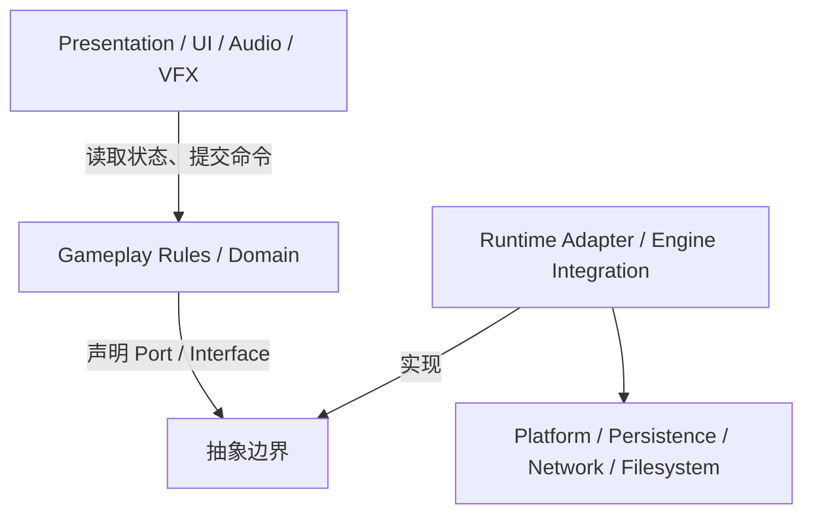

# 游戏项目命名与架构规范

这是一套默认规范，不是教条；若项目选择不同约定，必须在项目 README 记录理由。

## 命名

- 类型使用 PascalCase：`RoomGraph`, `DamageModifier`, `SaveGameService`。
- 方法/变量使用 camelCase（C#）或项目既定 C++ 风格；布尔值用 `is/has/can/should` 开头。
- 常量使用项目统一风格，不混用多种大小写体系。
- 事件使用过去式或 `On...`：`OnRoomCleared`, `ItemPickedUp`；命令使用动词：`ApplyDamage`, `GenerateRoom`。
- 数据定义和运行时实例分开：`ItemDefinition` ≠ `ItemInstance`，`EnemyArchetype` ≠ `EnemyRuntime`。
- 资产路径按领域组织：`Assets/Game/Gameplay/Items/`、`Assets/Game/UI/`、`Assets/Game/Tests/`；不要按作者个人文件夹组织。
- 禁止含糊名称：`Manager2`, `NewScript`, `Utils`, `Temp`, `Data`；若确实是服务，说明其生命周期和职责。

## 架构

默认依赖方向：

领域层只认识自己声明的抽象边界；引擎、存档、网络等适配器向内实现边界，具体平台依赖停留在外层。

核心规则：

- 领域规则不能直接调用 UI、场景对象或具体平台 API；
- 单例只用于真正的进程级服务，优先显式依赖和生命周期管理；
- 事件用于低耦合通知，但关键顺序/失败不能藏在不可追踪的全局事件里；
- 每个系统写清“谁拥有状态、谁能修改、何时初始化、何时销毁”；
- Tick/Update 不是万能入口：能事件驱动就不轮询，能批处理就不逐对象重复工作；
- 外部数据进入运行时前要校验、归一化、版本化；
- 每个模块至少有一条可观测路径：日志、断言、调试 UI、统计或测试。

## 肉鸽道具架构默认决策

推荐分层：

1. `ItemDefinition`：静态内容、标签、图标、规则参数；
2. `ItemInstance`：本局拥有状态、叠加层数、来源和持久化 ID；
3. `Effect/Modifier`：对伤害、射速、投射物、移动、房间事件等扩展点；
4. `Resolver/RulePipeline`：统一处理顺序、优先级、冲突、随机上下文；
5. `Event/Query`：用于“发生了什么”和“当前答案是什么”，避免到处互相引用。

任何“所有道具都要改玩家脚本”的设计都要视为重构预警。
